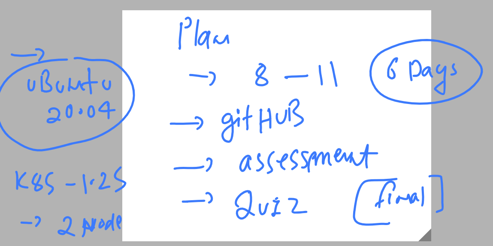
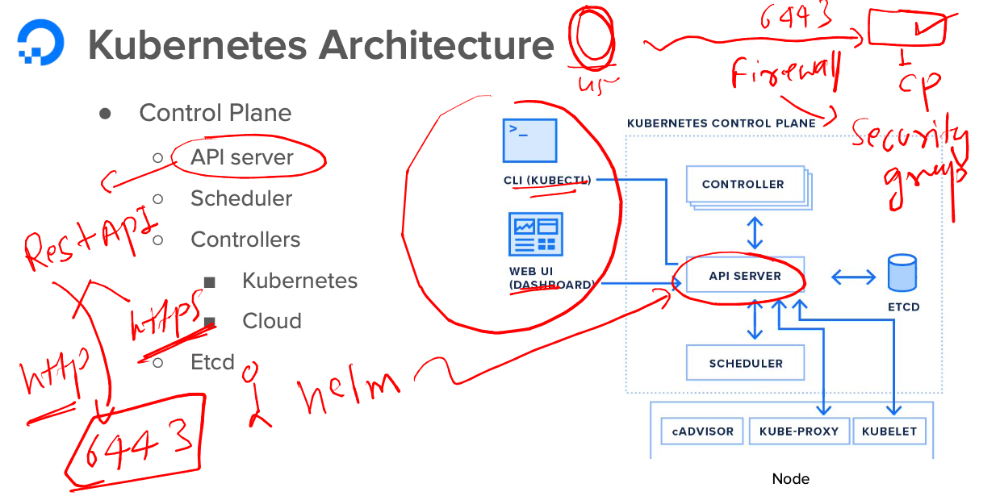
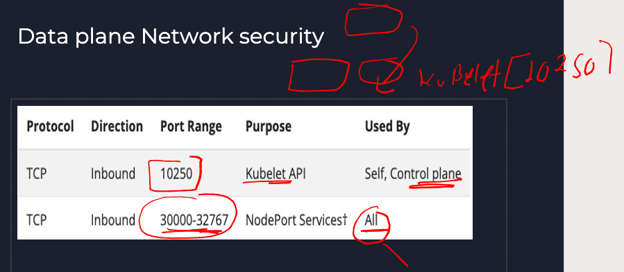
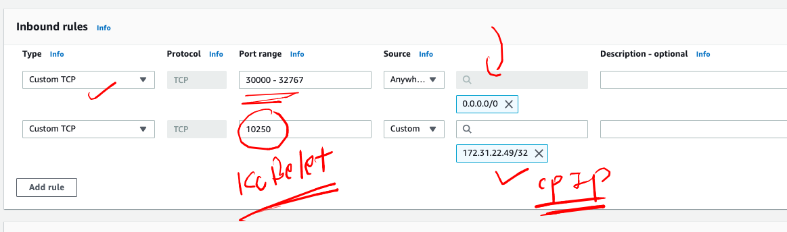
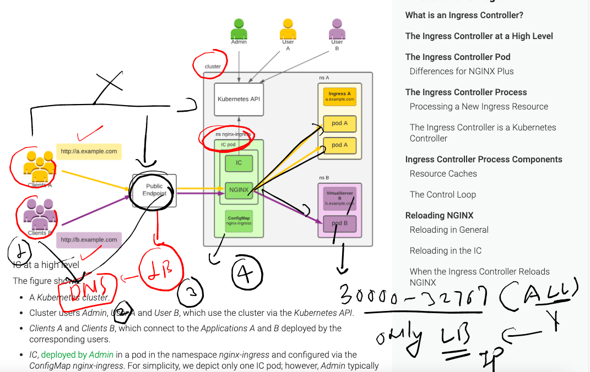
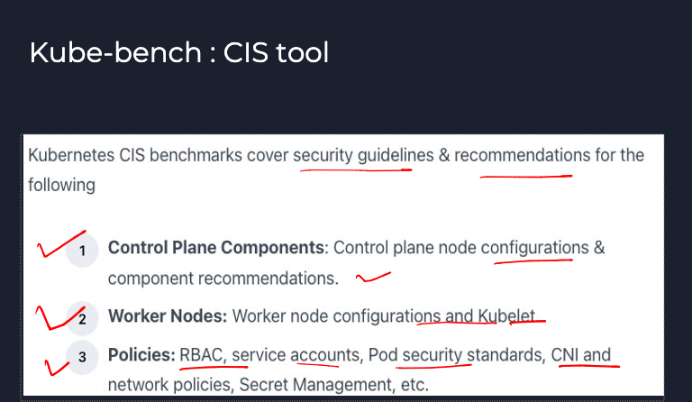
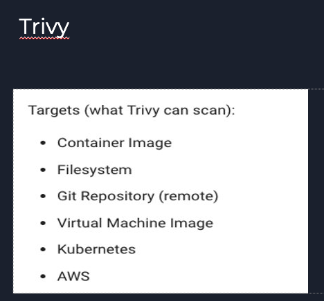
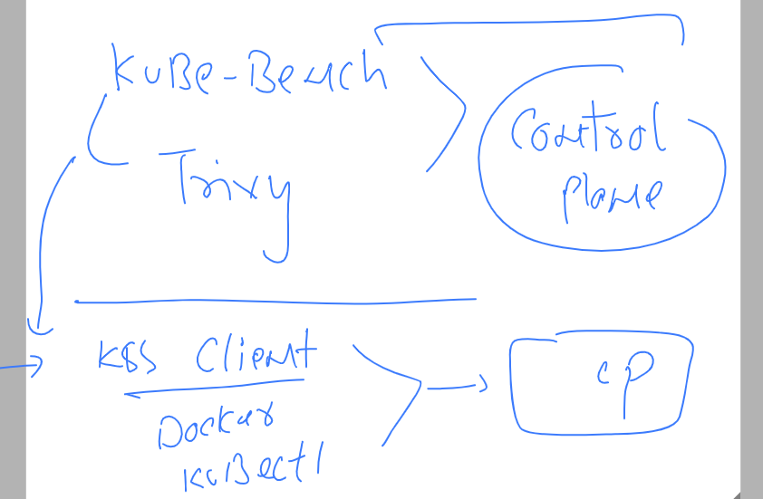

## Plan 



### revision of k8s 

### creating pod from kubectl 

```
root@ip-172-31-22-49:~# kubectl run pod1  --image=nginx --port 80 --dry-run=client 
pod/pod1 created (dry run)
root@ip-172-31-22-49:~# 
root@ip-172-31-22-49:~# kubectl get  po 
NAME               READY   STATUS      RESTARTS   AGE
kube-bench-w5djx   0/1     Completed   0          10h
root@ip-172-31-22-49:~# kubectl run pod1  --image=nginx --port 80 
pod/pod1 created
root@ip-172-31-22-49:~# kubectl get  po 
NAME               READY   STATUS              RESTARTS   AGE
kube-bench-w5djx   0/1     Completed           0          10h
pod1               0/1     ContainerCreating   0          2s
root@ip-172-31-22-49:~# 


```

### asking api-resource help from kubectl 

```
182  kubectl  explain   pod 
  183  kubectl  explain   pod.spec 
  184  kubectl  explain   pod.spec.containers
```

### list of all control plane api-resources 

```
root@ip-172-31-22-49:~# kubectl  api-resources  
NAME                              SHORTNAMES   APIVERSION                             NAMESPACED   KIND
bindings                                       v1                                     true         Binding
componentstatuses                 cs           v1                                     false        ComponentStatus
configmaps                        cm           v1                                     true         ConfigMap
endpoints                         ep           v1                                     true         Endpoints
events                            ev           v1                                     true         Event
limitranges                       limits       v1                                     true         LimitRange
namespaces                        ns           v1                                     false        Namespace

```

## K8s security primitives options 

### Infra Level 


### control plane access 



### data plane firewall security 



### aws security group for firewall 



### best way is Ingress controller based firewall



## CIS  for everything -- Standard of security 

### CIS for Kubernetes using -- kube-bench 



### to scan security vulnerability of given things we can use trivy 




## Installing trivy and kube-bench 

### 


### Installing trivy  On ubuntu 20.04 

```
ubuntu@ip-172-31-90-26:~$ whoami
ubuntu
ubuntu@ip-172-31-90-26:~$ sudo apt update 
Hit:1 http://us-east-1.ec2.archive.ubuntu.com/ubuntu focal InRelease
Hit:2 http://us-east-1.ec2.archive.ubuntu.com/ubuntu focal-updates InRelease
Hit:3 http://us-east-1.ec2.archive.ubuntu.com/ubuntu focal-backports InRelease
Hit:4 http://security.ubuntu.com/ubuntu focal-security InRelease
Reading package lists... Done
Building dependency tree       
Reading state information... Done
9 packages can be upgraded. Run 'apt list --upgradable' to see them.


========OR --


ubuntu@ip-172-31-90-26:~$ sudo -i
root@ip-172-31-90-26:~# apt update 
Hit:1 http://us-east-1.ec2.archive.ubuntu.com/ubuntu focal InRelease
Hit:2 http://us-east-1.ec2.archive.ubuntu.com/ubuntu focal-updates InRelease
Hit:3 http://us-east-1.ec2.archive.ubuntu.com/ubuntu focal-backports InRelease
Hit:4 http://security.ubuntu.com/ubuntu focal-security InRelease
Reading package lists... Done
Building dependency tree       
Reading state information... Done
9 packages can be upgraded. Run 'apt list --upgradable' to see them.
root@ip-172-31-90-26:~# 


```

### Link to use for installation 

[click_here](https://aquasecurity.github.io/trivy/v0.39/)

### Step 1

```
ubuntu@ip-172-31-90-26:~$ sudo apt-get install wget apt-transport-https gnupg lsb-release
Reading package lists... Done
Building dependency tree       
Reading state information... Done

```

### Step 2 

```
ubuntu@ip-172-31-90-26:~$ wget -qO - https://aquasecurity.github.io/trivy-repo/deb/public.key | gpg --dearmor | sudo tee /usr/share/keyrings/trivy.gpg > /dev/null
```

### step 3 

```
ubuntu@ip-172-31-90-26:~$ echo "deb [signed-by=/usr/share/keyrings/trivy.gpg] https://aquasecurity.github.io/trivy-repo/deb $(lsb_release -sc) main" | sudo tee -a /etc/apt/sources.list.d/trivy.list
deb [signed-by=/usr/share/keyrings/trivy.gpg] https://aquasecurity.github.io/trivy-repo/deb focal main
```

### Step 4 

```
ubuntu@ip-172-31-90-26:~$ sudo apt-get update && sudo apt-get install trivy  
```

### verify 

```
ubuntu@ip-172-31-90-26:~$ trivy -v
Version: 0.39.0
```

### without installing trivy -- we can use docker image of trivy 

```
root@ip-172-31-90-26:~# docker  pull  aquasec/trivy:0.39.0 
0.39.0: Pulling from aquasec/trivy
63b65145d645: Pull complete 
226473bcc6c2: Pull complete 
4f32983f87f5: Pull complete 
47501e0d9af6: Pull complete 
Digest: sha256:31b722478cc12191968908453f0136febc90350a669f9f9a27a8bce8293a2509
Status: Downloaded newer image for aquasec/trivy:0.39.0
docker.io/aquasec/trivy:0.39.0
root@ip-172-31-90-26:~# docker images
REPOSITORY      TAG       IMAGE ID       CREATED      SIZE
aquasec/trivy   0.39.0    c13e8b35e43f   5 days ago   207MB
root@ip-172-31-90-26:~# 


```

## Trivy security vulnerability scanning 

### scaning docker hub images

```
root@ip-172-31-90-26:~# trivy  image   mongo:latest  
2023-04-07T04:59:34.823Z	INFO	Need to update DB
2023-04-07T04:59:34.823Z	INFO	DB Repository: ghcr.io/aquasecurity/trivy-db
2023-04-07T04:59:34.824Z	INFO	Downloading DB...
36.42 MiB / 36.42 MiB [---------------------------------------------------------------------------] 100.00% 21.97 MiB p/s 1.9s
2023-04-07T04:59:37.059Z	INFO	Vulnerability scanning is enabled
2023-04-07T04:59:37.059Z	INFO	Secret scanning is enabled
2023-04-07T04:59:37.059Z	INFO	If your scanning is slow, please try '--scanners vuln' to disable secret scanning
2023-04-07T04:59:37.059Z	INFO	Please see also https://aquasecurity.github.io/trivy/v0.39/docs/secret/scanning/#recommendation for faster secret detection
2023-04-07T04:59:51.740Z	INFO	Detected OS: ubuntu
2023-04-07T04:59:51.740Z	INFO	Detecting Ubuntu vulnerabilities...
2023-04-07T04:59:51.744Z	INFO	Number of language-specific files: 1
2023-04-07T04:59:51.744Z	INFO	Detecting gobinary vulnerabilities...

mongo:latest (ubuntu 22.04)

Total: 35 (UNKNOWN: 0, LOW: 34, MEDIUM: 1, HIGH: 0, CRITICAL: 0)

┌────────────────┬────────────────┬──────────┬──────────────────────────┬────────────────────┬──────────────────────────────────────────────────────────────┐
│    Library     │ Vulnerability  │ Severity │    Installed Version     │   Fixed Version    │                            Title                             │
├────────────────┼────────────────┼──────────┼──────────────────────────┼────────────────────┼──────────────────────────────────────────────────────────────┤
│ bash           │ CVE-2022-3715  │ LOW      │ 5.1-6ubuntu1             │                    │ bash: a heap-buffer-overflow in valid_parameter_transform    │
│                │                │          │                        
```

### scaning image of  NOn docker hub like Quay.io 

```
trivy image  quay.io/libpod/alpine
```


