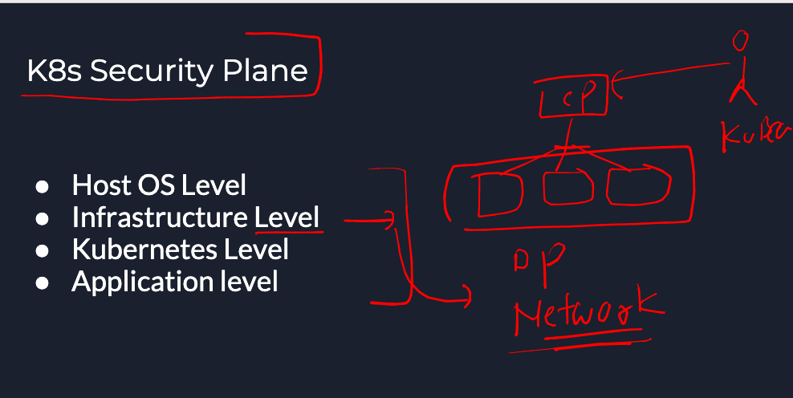

## Plan 


### revision of k8s 

### creating pod from kubectl 

```
root@ip-172-31-22-49:~# kubectl run pod1  --image=nginx --port 80 --dry-run=client 
pod/pod1 created (dry run)
root@ip-172-31-22-49:~# 
root@ip-172-31-22-49:~# kubectl get  po 
NAME               READY   STATUS      RESTARTS   AGE
kube-bench-w5djx   0/1     Completed   0          10h
root@ip-172-31-22-49:~# kubectl run pod1  --image=nginx --port 80 
pod/pod1 created
root@ip-172-31-22-49:~# kubectl get  po 
NAME               READY   STATUS              RESTARTS   AGE
kube-bench-w5djx   0/1     Completed           0          10h
pod1               0/1     ContainerCreating   0          2s
root@ip-172-31-22-49:~# 


```

### asking api-resource help from kubectl 

```
182  kubectl  explain   pod 
  183  kubectl  explain   pod.spec 
  184  kubectl  explain   pod.spec.containers
```

### list of all control plane api-resources 

```
root@ip-172-31-22-49:~# kubectl  api-resources  
NAME                              SHORTNAMES   APIVERSION                             NAMESPACED   KIND
bindings                                       v1                                     true         Binding
componentstatuses                 cs           v1                                     false        ComponentStatus
configmaps                        cm           v1                                     true         ConfigMap
endpoints                         ep           v1                                     true         Endpoints
events                            ev           v1                                     true         Event
limitranges                       limits       v1                                     true         LimitRange
namespaces                        ns           v1                                     false        Namespace

```

## K8s security primitives options 

### Infra Level 



### control plane access 


### data plane firewall security 


