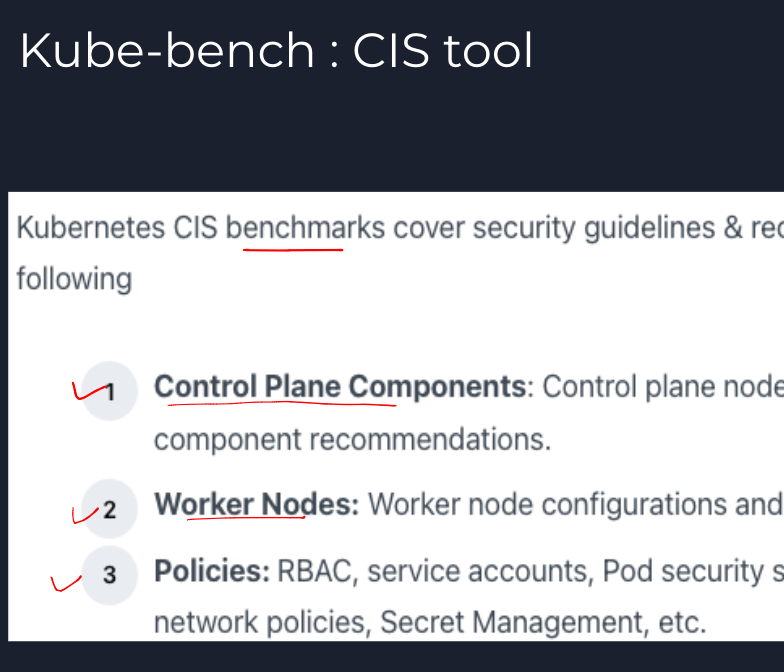
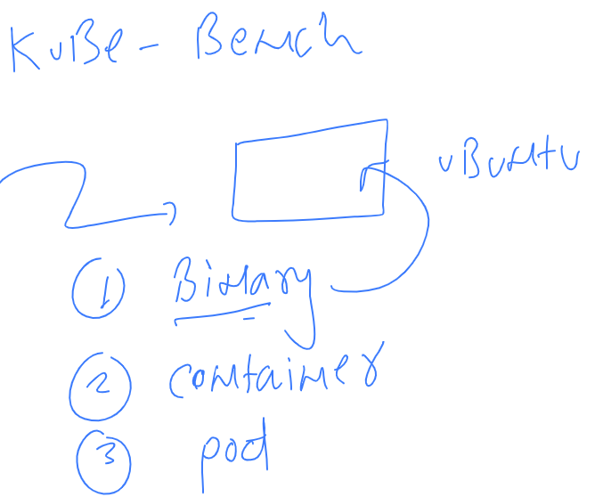

## Revision 

### kube-bench 



### Installation of kube-bench 



### Download binary and set in Linux PATH 

```
root@ip-172-31-22-49:~# mkdir  /opt/tools 
root@ip-172-31-22-49:~# cd /opt/tools/
root@ip-172-31-22-49:/opt/tools# curl -L https://github.com/aquasecurity/kube-bench/releases/download/v0.6.2/kube-bench_0.6.2_linux_amd64.tar.gz -o kube-bench_0.6.2_linux_amd64.tar.gz
  % Total    % Received % Xferd  Average Speed   Time    Time     Time  Current
                                 Dload  Upload   Total   Spent    Left  Speed
  0     0    0     0    0     0      0      0 --:--:-- --:--:-- --:--:--     0
100 7821k  100 7821k    0     0  24.4M      0 --:--:-- --:--:-- --:--:-- 24.4M
root@ip-172-31-22-49:/opt/tools# ls
kube-bench_0.6.2_linux_amd64.tar.gz
root@ip-172-31-22-49:/opt/tools# tar xvzf kube-bench_0.6.2_linux_amd64.tar.gz 
cfg/ack-1.0/config.yaml
cfg/ack-1.0/controlplane.yaml
cfg/ack-1.0/etcd.yaml
cfg/ack-1.0/managedservices.yaml

```

### copy Binary in Linux path variable section 

```
root@ip-172-31-22-49:/opt/tools# ls
cfg  kube-bench  kube-bench_0.6.2_linux_amd64.tar.gz
root@ip-172-31-22-49:/opt/tools# 
root@ip-172-31-22-49:/opt/tools# 
root@ip-172-31-22-49:/opt/tools# mv  kube-bench  /usr/bin/
root@ip-172-31-22-49:/opt/tools# 
root@ip-172-31-22-49:/opt/tools# kube-bench version 
0.6.2

```

## doing vulnerability scan using kube-bench 

```
 kube-bench  run   --config-dir  /opt/tools/cfg/   --config  /opt/tools/cfg/config.yaml 
 
 ===
 == Summary node ==
19 checks PASS
1 checks FAIL
3 checks WARN
0 checks INFO

[INFO] 5 Kubernetes Policies
[INFO] 5.1 RBAC and Service Accounts
[WARN] 5.1.1 Ensure that the cluster-admin role is only used where required (Manual)
[WARN] 5.1.2 Minimize access to secrets (Manual)
[WARN] 5.1.3 Minimize wildcard use in Roles and ClusterRoles (Manual)
[WARN] 5.1.4 Minimize access to create pods (Manual)
[WARN] 5.1.5 Ensure that default service accounts are not actively used. (Manual)
[WARN] 5.1.6 Ensure that Service Account Tokens are only mounted where necessary (Manual)
[INFO] 5.2 Pod Security Policies

```

### checking config.yaml of kube-bench 

```
root@ip-172-31-22-49:~# cd /opt/tools/cfg/
root@ip-172-31-22-49:/opt/tools/cfg# ls
ack-1.0  aks-1.0  cis-1.5  cis-1.6  config.yaml  eks-1.0  gke-1.0  rh-0.7  rh-1.0
root@ip-172-31-22-49:/opt/tools/cfg# vim config.yaml 
root@ip-172-31-22-49:/opt/tools/cfg# tail config.yaml 
    - "controlplane"
    - "etcd"
    - "policies"
    - "managedservices"
  "rh-1.0":
    - "master"
    - "node"
    - "controlplane"

```


