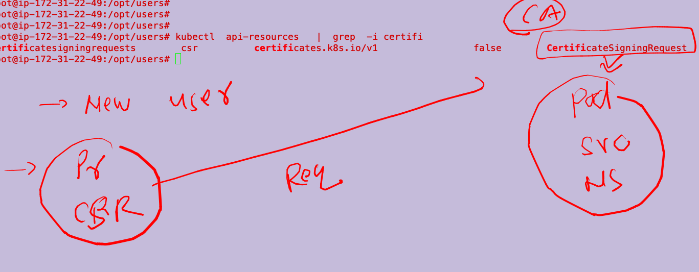
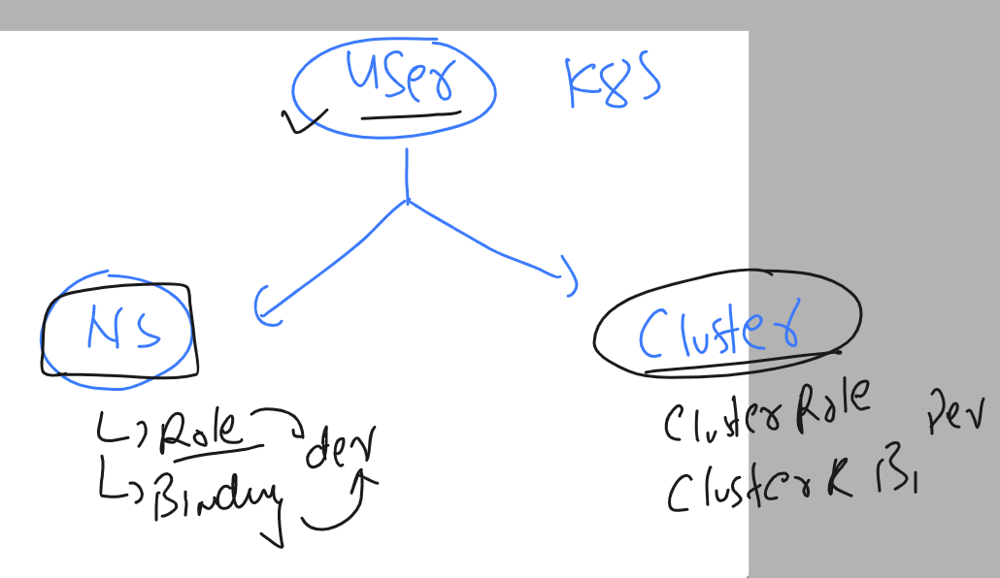

## Revision 

### kube-bench 


### Installation of kube-bench 


### Download binary and set in Linux PATH 

```
root@ip-172-31-22-49:~# mkdir  /opt/tools 
root@ip-172-31-22-49:~# cd /opt/tools/
root@ip-172-31-22-49:/opt/tools# curl -L https://github.com/aquasecurity/kube-bench/releases/download/v0.6.2/kube-bench_0.6.2_linux_amd64.tar.gz -o kube-bench_0.6.2_linux_amd64.tar.gz
  % Total    % Received % Xferd  Average Speed   Time    Time     Time  Current
                                 Dload  Upload   Total   Spent    Left  Speed
  0     0    0     0    0     0      0      0 --:--:-- --:--:-- --:--:--     0
100 7821k  100 7821k    0     0  24.4M      0 --:--:-- --:--:-- --:--:-- 24.4M
root@ip-172-31-22-49:/opt/tools# ls
kube-bench_0.6.2_linux_amd64.tar.gz
root@ip-172-31-22-49:/opt/tools# tar xvzf kube-bench_0.6.2_linux_amd64.tar.gz 
cfg/ack-1.0/config.yaml
cfg/ack-1.0/controlplane.yaml
cfg/ack-1.0/etcd.yaml
cfg/ack-1.0/managedservices.yaml

```

### copy Binary in Linux path variable section 

```
root@ip-172-31-22-49:/opt/tools# ls
cfg  kube-bench  kube-bench_0.6.2_linux_amd64.tar.gz
root@ip-172-31-22-49:/opt/tools# 
root@ip-172-31-22-49:/opt/tools# 
root@ip-172-31-22-49:/opt/tools# mv  kube-bench  /usr/bin/
root@ip-172-31-22-49:/opt/tools# 
root@ip-172-31-22-49:/opt/tools# kube-bench version 
0.6.2

```

## doing vulnerability scan using kube-bench 

```
 kube-bench  run   --config-dir  /opt/tools/cfg/   --config  /opt/tools/cfg/config.yaml 
 
 ===
 == Summary node ==
19 checks PASS
1 checks FAIL
3 checks WARN
0 checks INFO

[INFO] 5 Kubernetes Policies
[INFO] 5.1 RBAC and Service Accounts
[WARN] 5.1.1 Ensure that the cluster-admin role is only used where required (Manual)
[WARN] 5.1.2 Minimize access to secrets (Manual)
[WARN] 5.1.3 Minimize wildcard use in Roles and ClusterRoles (Manual)
[WARN] 5.1.4 Minimize access to create pods (Manual)
[WARN] 5.1.5 Ensure that default service accounts are not actively used. (Manual)
[WARN] 5.1.6 Ensure that Service Account Tokens are only mounted where necessary (Manual)
[INFO] 5.2 Pod Security Policies

```

### checking config.yaml of kube-bench 

```
root@ip-172-31-22-49:~# cd /opt/tools/cfg/
root@ip-172-31-22-49:/opt/tools/cfg# ls
ack-1.0  aks-1.0  cis-1.5  cis-1.6  config.yaml  eks-1.0  gke-1.0  rh-0.7  rh-1.0
root@ip-172-31-22-49:/opt/tools/cfg# vim config.yaml 
root@ip-172-31-22-49:/opt/tools/cfg# tail config.yaml 
    - "controlplane"
    - "etcd"
    - "policies"
    - "managedservices"
  "rh-1.0":
    - "master"
    - "node"
    - "controlplane"

```

### cluster security -- using authentication of kube-apiserver 


### k8s is not having any method to create normal users 


### SSL is by default method of config to connect k8s api-server

```
root@ip-172-31-22-49:~# cd  /etc/kubernetes/
root@ip-172-31-22-49:/etc/kubernetes# ls
admin.conf  controller-manager.conf  kubelet.conf  manifests  pki  scheduler.conf
root@ip-172-31-22-49:/etc/kubernetes# less  admin.conf 
root@ip-172-31-22-49:/etc/kubernetes# 
root@ip-172-31-22-49:/etc/kubernetes# 
root@ip-172-31-22-49:/etc/kubernetes# kubectl get  nodes --kubeconfig  admin.conf 
NAME               STATUS   ROLES           AGE     VERSION
ip-172-31-22-49    Ready    control-plane   4d19h   v1.25.8
ip-172-31-25-185   Ready    <none>          4d18h   v1.25.8
ip-172-31-29-26    Ready    <none>          4d19h   v1.25.8
root@ip-172-31-22-49:/etc/kubernetes# 
root@ip-172-31-22-49:/etc/kubernetes# 
root@ip-172-31-22-49:/etc/kubernetes# 
root@ip-172-31-22-49:/etc/kubernetes# cp -v admin.conf   ~/.kube/config  ^C
root@ip-172-31-22-49:/etc/kubernetes# 
root@ip-172-31-22-49:/etc/kubernetes# 
root@ip-172-31-22-49:/etc/kubernetes# 
root@ip-172-31-22-49:/etc/kubernetes# kubectl get nodes
NAME               STATUS   ROLES           AGE     VERSION
ip-172-31-22-49    Ready    control-plane   4d19h   v1.25.8
ip-172-31-25-185   Ready    <none>          4d18h   v1.25.8
ip-172-31-29-26    Ready    <none>          4d19h   v1.25.8

```

### kuberetes authentication methods / options 


### using SSL to create certificates --for k8s auth purpose 


## Lets create SSL based user for k8s deployment 

## user named Dev i wanna create 

### Step 1  -- to create private key of that user 

```
 mkdir  /opt/users
  cd  /opt/users/
  root@ip-172-31-22-49:/opt/users# openssl  genrsa  -out  dev.key 
Generating RSA private key, 2048 bit long modulus (2 primes)
..............................................+++++
.......+++++
e is 65537 (0x010001)
root@ip-172-31-22-49:/opt/users# ls
dev.key

```

### step 2 generate. CSR (certificate signing request)

```
root@ip-172-31-22-49:/opt/users# ls
dev.key
root@ip-172-31-22-49:/opt/users# openssl req  -new -key dev.key  -out dev.csr 
You are about to be asked to enter information that will be incorporated
into your certificate request.
What you are about to enter is what is called a Distinguished Name or a DN.
There are quite a few fields but you can leave some blank
For some fields there will be a default value,
If you enter '.', the field will be left blank.
-----
Country Name (2 letter code) [AU]:IN
State or Province Name (full name) [Some-State]:RAJ
Locality Name (eg, city) []:JAIPUR
Organization Name (eg, company) [Internet Widgits Pty Ltd]:Adhoc
Organizational Unit Name (eg, section) []:tech
Common Name (e.g. server FQDN or YOUR name) []:dev # give only user name 
Email Address []:

Please enter the following 'extra' attributes
to be sent with your certificate request
A challenge password []:
An optional company name []:
root@ip-172-31-22-49:/opt/users# 
root@ip-172-31-22-49:/opt/users# ls
dev.csr  dev.key

```

###  k8s is having its default CA. where we can send CSR to signed 



### creating CSR request to CA of control plane 

### convert csr of dev user to base64 encode 

```
root@ip-172-31-22-49:/opt/users# cat  dev.csr   | base64   -w 0
LS0tLS1CRUdJTiBDRVJUSUZJQ0FURSBSRVFVRVNULS0tLS0KTUlJQ25qQ0NBWVlDQVFBd1dURUxNQWtHQTFVRUJoTUNTVTR4RERBS0JnTlZCQWdNQTFKQlNqRVBNQTBHQTFVRQpCd3dHU2tGSlVGVlNNUTR3REFZRFZRUUtEQVZCWkdodll6RU5NQXNHQTFVRUN3d0VkR1ZqYURFTU1Bb0dBMVVFCkF3d0RaR1YyTUlJQklqQU5CZ2txaGtpRzl3MEJBUUVGQUFPQ0FROEFNSUlCQ2dLQ0FRRUF0MWkzUU14eVZzc2oKZmNQWmI3eDVXSDVNZ0RqWnRLazk2cExqd2JsTk41RXNBL2FYSjdwbnRYNXFCeUNKdGxla1hrWEVmNm9jV0FrdgpxZGh5b2NtQjM5ejhzY2hmVGQxT
```

### Step 3 : send request to CA of control plane 

```
apiVersion: certificates.k8s.io/v1
kind: CertificateSigningRequest
metadata:
  name: dev-user-request
spec:
  expirationSeconds: 86440 # seconds 
  signerName: kubernetes.io/kube-apiserver-client
  request: LS0tLS1CRUdJTiBDRVJUSUZJQ0FURSBSRVFVRVNULS0tLS0KTUlJQ25qQ0NBWVlDQVFBd1dURUxNQWtHQTFVRUJoTUNTVTR4RERBS0JnTlZCQWdNQTFKQlNqRVBNQTBHQTFVRQpCd3dHU2tGSlVGVlNNUTR3REFZRFZRUUtEQVZCWkdodll6RU5NQXNHQTFVRUN3d0VkR1ZqYURFTU1Bb0dBMVVFCkF3d0RaR1YyTUlJQklqQU5CZ2txaGtpRzl3MEJBUUVGQUFPQ0FROEFNSUlCQ2dLQ0FRRUF0MWkzUU14eVZzc2oKZmNQWmI3eDVXSDVNZ0RqWnRLazk2cExqd2JsTk41RXNBL2FYSjdwbnRYNXFCeUNKdGxla1hrWEVmNm9jV0FrdgpxZGh5b2NtQjM5ejhzY2hmVGQxTFhqeHB4RHBxbW5FRjlBdWkwS05NWWxYUjB4V0RFSnhGUkdKZlVmbHJSeVNqCnl3RmoxSFZpdUZ2blpMK1ZId1VhTHhxSGprcEdkTHIvQ245UXRoUkNaR0NISjVyeG9VUVRzT0Q4RS9nVnFUbEUKYzBuR05HRkVQaG54MHpsRlVUNGtXUkNkZ3JzTVNhbmJtN2dnaDZhL1MwRHozclBMQlNNeHFFMXpzUDB4TFNYNwpadG8xQVJ3NFpmVzR5Rk5NR3ZxK0MvWjRJRGNPS0tYTFlpcUJjTGV1ZW1QZVp2NHRQUEVGbEFqZG9FdStRYXV6Ck9QUGFYQytOa3dJREFRQUJvQUF3RFFZSktvWklodmNOQVFFTEJRQURnZ0VCQUVPUHpMZFNEdVlReFYrNE9KMVgKL2FwMGZHek44NlV0K1h0MDUzWllvTTBIVThLYlp0RmdSaklXcjl4TzZjNXZsUHp3bkFWMGlrdzRyV1FvcW1VVAorQWJwZ3ZBN2MyNHVnTGdLcTVwTTZKbWJKTy90Q09DVDFyK25ML0k4Y000SWZGRzFJaUxrRFRObEUxOFl4TGVwCnFUWW9BMWdLejlMcWcrN05qWUo3YmJWTjlZMTQ0ZlNYaGlSV1VRT0pqYmlIb05VOUZsVE9ISjhoWkF2MHVMTloKZHpucjNkdkhDUEwvYnFjZHo3UzI0Slp6UjlrUlJxRURYVTI3NUR3bk4zTktmd3pmSUh2azUyREdNV1VSc3RpUQpZODR3MTJxWG1JaUlTL1FzalIzaGJ0NHk1bDZJUTRLWVJWM2t6a25lc0w4WlhyU1Bka2tkck13OC91S25yQVFCCk5tVT0KLS0tLS1FTkQgQ0VSVElGSUNBVEUgUkVRVUVTVC0tLS0tCg==
  usages:
  - client auth
  
```

### sending request 

```
root@ip-172-31-22-49:/opt/users# kubectl apply -f request.yaml  
certificatesigningrequest.certificates.k8s.io/dev-user-request created
root@ip-172-31-22-49:/opt/users# 
root@ip-172-31-22-49:/opt/users# 
root@ip-172-31-22-49:/opt/users# kubectl get  csr
NAME               AGE   SIGNERNAME                            REQUESTOR          REQUESTEDDURATION   CONDITION
dev-user-request   6s    kubernetes.io/kube-apiserver-client   kubernetes-admin   24h                 Pending
root@ip-172-31-22-49:/opt/users# cat  request.yaml 

```

### Final super user of k8s will sign that request 

```
root@ip-172-31-22-49:/opt/users# kubectl certificate 
Modify certificate resources.

Available Commands:
  approve       Approve a certificate signing request
  deny          Deny a certificate signing request

Usage:
  kubectl certificate SUBCOMMAND [options]

Use "kubectl <command> --help" for more information about a given command.
Use "kubectl options" for a list of global command-line options (applies to all commands).
root@ip-172-31-22-49:/opt/users# 
root@ip-172-31-22-49:/opt/users# 
root@ip-172-31-22-49:/opt/users# kubectl get  csr
NAME               AGE     SIGNERNAME                            REQUESTOR          REQUESTEDDURATION   CONDITION
dev-user-request   2m58s   kubernetes.io/kube-apiserver-client   kubernetes-admin   24h                 Pending
root@ip-172-31-22-49:/opt/users# kubectl certificate  approve  dev-user-request 
certificatesigningrequest.certificates.k8s.io/dev-user-request approved
root@ip-172-31-22-49:/opt/users# 
root@ip-172-31-22-49:/opt/users# kubectl get  csr
NAME               AGE     SIGNERNAME                            REQUESTOR          REQUESTEDDURATION   CONDITION
dev-user-request   3m35s   kubernetes.io/kube-apiserver-client   kubernetes-admin   24h                 Approved,Issued
root@ip-172-31-22-49:/opt/users# 
```

### lets check CRT 

```
root@ip-172-31-22-49:/opt/users# kubectl get  csr  dev-user-request -o yaml   |  grep -iw certificate
  certificate: LS0tLS1CRUdJTiBDRVJUSUZJQ0FURS0tLS0tCk1JSURQakNDQWlhZ0F3SUJBZ0lRRlltL05lT0hWM2NNYTdtTEgwaU1sakFOQmdrcWhraUc5dzBCQVFzRkFEQVYKTVJNd0VRWURWUVFERXdwcmRXSmxjbTVsZEdWek1CNFhEVEl6TURReE1EQTBNRGMwTjFvWERUSXpNRFF4TVRBMApNRGd5TjFvd1dURUxNQWtHQTFVRUJoTUNTVTR4RERBS0JnTlZCQWdUQTFKQlNqRVBNQTBHQTFVRUJ4TUdTa0ZKClVGVlNNUTR3REFZRFZRUUtFd1ZCWkdodll6RU5NQXNHQTFVRUN4TUVkR1ZqYURFTU1Bb0dBMVVFQXhNRFpHVjIKTUlJQklqQU5CZ2txaGtpRzl3MEJBUUVGQUFPQ0FROEFNSUlCQ2dLQ0FRRUF0MWkzUU14eVZzc2pmY1BaYjd4NQpXSDVNZ0RqWnRLazk2cExqd2JsTk41RXNBL2FYSjdwbnRYNXFCeUNKdGxla1hrWEVmNm9jV0FrdnFkaHlvY21CCjM5ejhzY2hmVGQxTFhqeHB4RHBxbW5FRjlBdWkwS05NWWxYUjB4V0RFSnhGUkdKZlVmbHJSeVNqeXdGajFIVmkKdUZ2blpMK1ZId1VhTHhxSGprcEdkTHIvQ245UXRoUkNaR0NISjVyeG9VUVRzT0Q4RS9nVnFUbEVjMG5HTkdGRQpQaG54MHpsRlVUNGtXUkNkZ3JzTVNhbmJtN2dnaDZhL1MwRHozclBMQlNNeHFFMXpzUDB4TFNYN1p0bzFBUnc0ClpmVzR5Rk5NR3ZxK0MvWjRJRGNPS0tYTFlpcUJjTGV1ZW1QZVp2NHRQUEVGbEFqZG9FdStRYXV6T1BQYVhDK04Ka3dJREFRQUJvMFl3UkRBVEJnTlZIU1VFRERBS0JnZ3JCZ0VGQlFjREFqQU1CZ05WSFJNQkFmOEVBakFBTUI4RwpBMVVkSXdRWU1CYUFGTlpJbElKSENVVGIwVllrWCtUSFZvbFRDNHhlTUEwR0NTcUdTSWIzRFFFQkN3VUFBNElCCkFRQW9GdGlNYmdkZHp2RTJ4amlvRkUzdFVjQ0lyNnZ4QlRBU201dlQvaWZ4Um94cCt6NDByUWJTM1QxVExpL3gKbjdiUEgwZ2Z6aTllMlI2TytrS2tnbDVUeVRtcWJJRkpobkJMSldVVXhMSHp0TjRVWjZDVDNBell6dkNUbXlSZgpHR2VqL2FoYm5yWTgyUEZXdWlGdTFLaDBGb3hqdTgrbnNSakdpNjdHcXhSZ0tUOFJWY2prRmhlOGlEUTB0UjdyCnR2WTFTQWlNV25EV2kzWUNoWHJqQ05MYTU5MnJDUlRtcEFRaUJPQ1YvbExDOE42OVdOYTZQUjlDSWxwczRpdXoKUmVubHgyVWx4QzlGN0xkL0lYQUY0WVlJVmNrMVBqTHp3V3BNMndBZkdpUFFPWTRHalMyVWpyZmw4aVNWNmxrVwpvZGVEd0lhQitFQlVUWlYwa2dydWhVQUgKLS0tLS1FTkQgQ0VSVElGSUNBVEUtLS0tLQo=
    message: This CSR was approved by kubectl certificate approve.
```

### lets pick crt only 

```
echo "LS0tLS1CRUdJTiBDRVJUSUZJQ0FURS0tLS0tCk1JSURQakNDQWlhZ0F3SUJBZ0lRRlltL05lT0hWM2NNYTdtTEgwaU1sakFOQmdrcWhraUc5dzBCQVFzRkFEQVYKTVJNd0VRWURWUVFERXdwcmRXSmxjbTVsZEdWek1CNFhEVEl6TURReE1EQTBNRGMwTjFvWERUSXpNRFF4TVRBMApNRGd5TjFvd1dURUxNQWtHQTFVRUJoTUNTVTR4RERBS0JnTlZCQWdUQTFKQlNqRVBNQTBHQTFVRUJ4TUdTa0ZKClVGVlNNUTR3REFZRFZRUUtFd1ZCWkdodll6RU5NQXNHQTFVRUN4TUVkR1ZqYURFTU1Bb0dBMVVFQXhNRFpHVjIKTUlJQklqQU5CZ2txaGtpRzl3MEJBUUVGQUFPQ0FROEFNSUlCQ2dLQ0FRRUF0MWkzUU14eVZzc2pmY1BaYjd4NQpXSDVNZ0RqWnRLazk2cExqd2JsTk41RXNBL2FYSjdwbnRYNXFCeUNKdGxla1hrWEVmNm9jV0FrdnFkaHlvY21CCjM5ejhzY2hmVGQxTFhqeHB4RHBxbW5FRjlBdWkwS05NWWxYUjB4V0RFSnhGUkdKZlVmbHJSeVNqeXdGajFIVmkKdUZ2blpMK1ZId1VhTHhxSGprcEdkTHIvQ245UXRoUkNaR0NISjVyeG9VUVRzT0Q4RS9nVnFUbEVjMG5HTkdGRQpQaG54MHpsRlVUNGtXUkNkZ3JzTVNhbmJtN2dnaDZhL1MwRHozclBMQlNNeHFFMXpzUDB4TFNYN1p0bzFBUnc0ClpmVzR5Rk5NR3ZxK0MvWjRJRGNPS0tYTFlpcUJjTGV1ZW1QZVp2NHRQUEVGbEFqZG9FdStRYXV6T1BQYVhDK04Ka3dJREFRQUJvMFl3UkRBVEJnTlZIU1VFRERBS0JnZ3JCZ0VGQlFjREFqQU1CZ05WSFJNQkFmOEVBakFBTUI4RwpBMVVkSXdRWU1CYUFGTlpJbElKSENVVGIwVllrWCtUSFZvbFRDNHhlTUEwR0NTcUdTSWIzRFFFQkN3VUFBNElCCkFRQW9GdGlNYmdkZHp2RTJ4amlvRkUzdFVjQ0lyNnZ4QlRBU201dlQvaWZ4Um94cCt6NDByUWJTM1QxVExpL3gKbjdiUEgwZ2Z6aTllMlI2TytrS2tnbDVUeVRtcWJJRkpobkJMSldVVXhMSHp0TjRVWjZDVDNBell6dkNUbXlSZgpHR2VqL2FoYm5yWTgyUEZXdWlGdTFLaDBGb3hqdTgrbnNSakdpNjdHcXhSZ0tUOFJWY2prRmhlOGlEUTB0UjdyCnR2WTFTQWlNV25EV2kzWUNoWHJqQ05MYTU5MnJDUlRtcEFRaUJPQ1YvbExDOE42OVdOYTZQUjlDSWxwczRpdXoKUmVubHgyVWx4QzlGN0xkL0lYQUY0WVlJVmNrMVBqTHp3V3BNMndBZkdpUFFPWTRHalMyVWpyZmw4aVNWNmxrVwpvZGVEd0lhQitFQlVUWlYwa2dydWhVQUgKLS0tLS1FTkQgQ0VSVElGSUNBVEUtLS0tLQo="   | base64 -d   >dev.crt
```

### now checking 

```
root@ip-172-31-22-49:/opt/users# ls
dev.crt  dev.csr  dev.key  request.yaml
```


## adding. dev user in kubeconf file 

### checking default kubeconfig 
```
root@ip-172-31-22-49:/opt/users# kubectl  config  view 
apiVersion: v1
clusters:
- cluster:
    certificate-authority-data: DATA+OMITTED
    server: https://172.31.22.49:6443
  name: kubernetes
contexts:
- context:
    cluster: kubernetes
    user: kubernetes-admin
  name: kubernetes-admin@kubernetes
current-context: kubernetes-admin@kubernetes
kind: Config
preferences: {}
users:
- name: kubernetes-admin
  user:
    client-certificate-data: REDACTED
    client-key-data: REDACTED

```

### adding one more user -- dev 

```
root@ip-172-31-22-49:/opt/users# kubectl config set-credentials dev  --client-key=dev.key  --client-certificate=dev.crt 
User "dev" set.

```

### checking 

```
root@ip-172-31-22-49:/opt/users# kubectl  config  view 
apiVersion: v1
clusters:
- cluster:
    certificate-authority-data: DATA+OMITTED
    server: https://172.31.22.49:6443
  name: kubernetes
contexts:
- context:
    cluster: kubernetes
    user: kubernetes-admin
  name: kubernetes-admin@kubernetes
current-context: kubernetes-admin@kubernetes
kind: Config
preferences: {}
users:
- name: dev
  user:
    client-certificate: /opt/users/dev.crt
    client-key: /opt/users/dev.key
- name: kubernetes-admin
  user:
    client-certificate-data: REDACTED
    client-key-data: REDACTED

```

### Context to creating multile user profile in k8s cluster

```
root@ip-172-31-22-49:/opt/users# kubectl  config get-contexts 
CURRENT   NAME                          CLUSTER      AUTHINFO           NAMESPACE
*         kubernetes-admin@kubernetes   kubernetes   kubernetes-admin   
root@ip-172-31-22-49:/opt/users# 
root@ip-172-31-22-49:/opt/users# 
root@ip-172-31-22-49:/opt/users# 
root@ip-172-31-22-49:/opt/users# 
root@ip-172-31-22-49:/opt/users# 
root@ip-172-31-22-49:/opt/users# kubectl config set-context my-developer --user=dev   --cluster kubernetes 
Context "my-developer" created.
root@ip-172-31-22-49:/opt/users# 
root@ip-172-31-22-49:/opt/users# kubectl  config get-contexts 
CURRENT   NAME                          CLUSTER      AUTHINFO           NAMESPACE
*         kubernetes-admin@kubernetes   kubernetes   kubernetes-admin   
          my-developer                  kubernetes   dev                
root@ip-172-31-22-49:/opt/users# 


```

### switching context 

```
root@ip-172-31-22-49:/opt/users# kubectl config use-context   my-developer 
Switched to context "my-developer".
root@ip-172-31-22-49:/opt/users# kubectl  config get-contexts 
CURRENT   NAME                          CLUSTER      AUTHINFO           NAMESPACE
          kubernetes-admin@kubernetes   kubernetes   kubernetes-admin   
*         my-developer                  kubernetes   dev                
root@ip-172-31-22-49:/opt/users# 
root@ip-172-31-22-49:/opt/users# 
root@ip-172-31-22-49:/opt/users# kubectl  get  nodes
Error from server (Forbidden): nodes is forbidden: User "dev" cannot list resource "nodes" in API group "" at the cluster scope
root@ip-172-31-22-49:/opt/users# 
root@ip-172-31-22-49:/opt/users# kubectl  get  po
Error from server (Forbidden): pods is forbidden: User "dev" cannot list resource "pods" in API group "" in the namespace "default"
root@ip-172-31-22-49:/opt/users# kubectl  get ns
Error from server (Forbidden): namespaces is forbidden: User "dev" cannot list resource "namespaces" in API group "" at the cluster scope

```

### RBAC in k8s 



## Creating restric access to Dev user 

### creating ns 

```
 kubectl create  ns  app-test 
```

### creating role 

```
root@ip-172-31-22-49:~# cat  role.yaml 
apiVersion: rbac.authorization.k8s.io/v1
kind: Role
metadata:
  creationTimestamp: null
  name: app-access
  namespace: app-test
rules:
- apiGroups:
  - ""
  resources:
  - pods
  verbs:
  - get
  - list
  - create
  resources:
  - services
  verbs:
  - get
  - list
  - create

```

### 

```
root@ip-172-31-22-49:~# kubectl apply -f role.yaml 
role.rbac.authorization.k8s.io/app-access configured
root@ip-172-31-22-49:~# 
root@ip-172-31-22-49:~# kubectl get role -n app-test 
NAME         CREATED AT
app-access   2023-04-10T05:18:02Z
root@ip-172-31-22-49:~# 

```

### creating role-binding -- role to dev user

```
kubectl create rolebinding  give-access --role=app-access  --user=dev -n app-test --dry-run=client -o yaml  >bind.yaml 
root@ip-172-31-22-49:~# kubectl apply -f bind.yaml 
rolebinding.rbac.authorization.k8s.io/give-access created
root@ip-172-31-22-49:~# 
root@ip-172-31-22-49:~# kubectl get rolebindings.rbac.authorization.k8s.io  -n app-test 
NAME          ROLE              AGE
give-access   Role/app-access   10s
root@ip-172-31-22-49:~# kubectl get rolebindings  -n app-test 
NAME          ROLE              AGE
give-access   Role/app-access   18s
```


