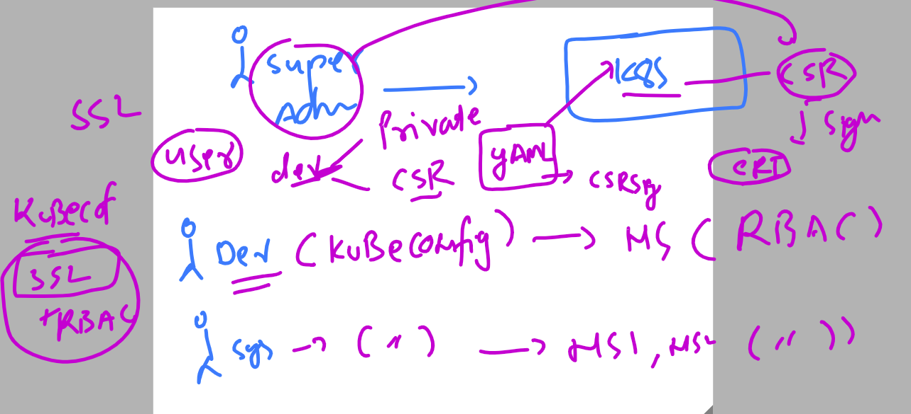

## Revision 

### Understand security with RBAC & SSL 


### kubeconfig custom file 



### service account story in kubernetes versions 


### security alter automount of secret of namespace service account 


### Deploy pod 

```
root@ip-172-31-22-49:~# kubectl run ashupod1 --image=nginx --port 80 --dry-run=client -o yaml  >podx.yaml 
root@ip-172-31-22-49:~# 
root@ip-172-31-22-49:~# kubectl get po
No resources found in default namespace.
root@ip-172-31-22-49:~# kubectl apply -f podx.yaml 
pod/ashupod1 created
root@ip-172-31-22-49:~# kubectl get po 
NAME       READY   STATUS    RESTARTS   AGE
ashupod1   1/1     Running   0          4s
root@ip-172-31-22-49:~# 
```

### checking secret of pod 

```
root@ip-172-31-22-49:~# kubectl exec -it  ashupod1  -- bash 
root@ashupod1:/# 
root@ashupod1:/# 
root@ashupod1:/# cd /var/run
root@ashupod1:/var/run# ls
lock  nginx.pid  secrets  utmp
root@ashupod1:/var/run# cd secrets/
root@ashupod1:/var/run/secrets# ls
kubernetes.io
root@ashupod1:/var/run/secrets# cd kubernetes.io/
root@ashupod1:/var/run/secrets/kubernetes.io# ls
serviceaccount
root@ashupod1:/var/run/secrets/kubernetes.io# ls -l
total 0
drwxrwxrwt 3 root root 140 Apr 11 03:40 serviceaccount
root@ashupod1:/var/run/secrets/kubernetes.io# cd serviceaccount/
root@ashupod1:/var/run/secrets/kubernetes.io/serviceaccount# ls
ca.crt	namespace  token
root@ashupod1:/var/run/secrets/kubernetes.io/serviceaccount# cat token 
eyJhbGciOiJSUzI1NiIsImtpZCI6IkN2QjhrMWtwSHhNbjlLR0xKSmhnc0lIcGRFYUZXYmFtNFlUSVFqeWoyalUifQ.eyJhdWQiOlsiaHR0cHM6Ly9rdWJlcm5ldGVzLmRlZmF1bHQuc3ZjLmNsdXN0ZXIubG9jYWwiXSwiZXhwIjoxNzEyNzIwNDU1LCJpYXQiOjE2ODExODQ0NTUsImlzcyI6Imh0dHBzOi8va3ViZXJuZXRlcy5kZWZhdWx0LnN2Yy5jbHVzdGVyLmxvY2FsIiwia3ViZXJuZXRlcy5pbyI6eyJuYW1lc3BhY2UiOiJkZWZhdWx0IiwicG9kIjp7Im5hbWUiOiJhc2h1cG9kMSIsInVpZCI6IjFmM2JhODM3L
```

### blocking service account mounting 

```
root@ip-172-31-22-49:~# cat  podx.yaml 
apiVersion: v1
kind: Pod
metadata:
  creationTimestamp: null
  labels:
    run: ashupod1
  name: ashupod1
spec:
  automountServiceAccountToken: false # blocking secret mounting 
  containers:
  - image: nginx
    name: ashupod1
    ports:
    - containerPort: 80
    resources: {}
  dnsPolicy: ClusterFirst
  restartPolicy: Always
```


