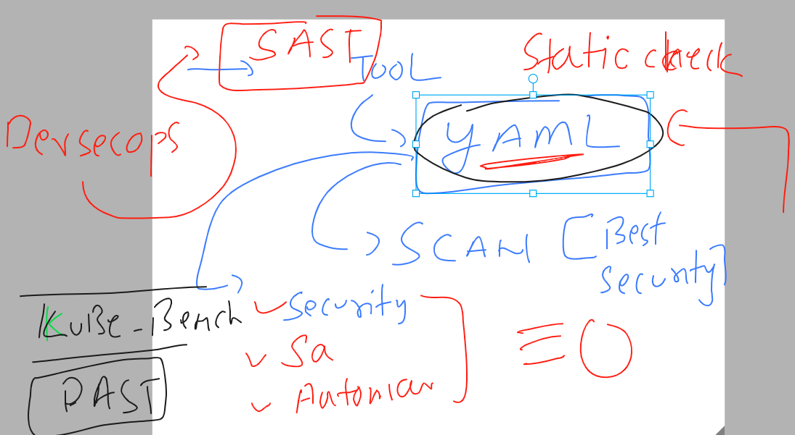
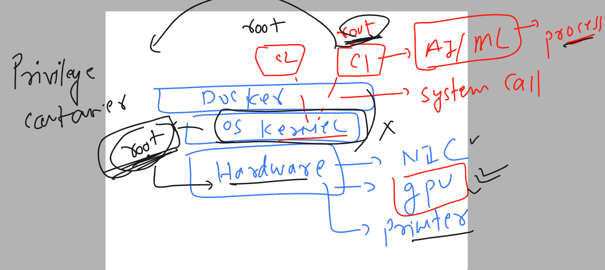

## Revision 


### Target for today 


### Note : even we don't have permmission of kubeconfig file but by using token of default svc account we can send some request from inside pod

```
root@ashupod1:/var/run/secrets/kubernetes.io/serviceaccount# curl https://10.96.0.1 -k 
{
  "kind": "Status",
  "apiVersion": "v1",
  "metadata": {},
  "status": "Failure",
  "message": "forbidden: User \"system:anonymous\" cannot get path \"/\"",
  "reason": "Forbidden",
  "details": {},
  "code": 403
}root@ashupod1:/var/run/secrets/kubernetes.io/serviceaccount# ls
ca.crt	namespace  token
root@ashupod1:/var/run/secrets/kubernetes.io/serviceaccount# curl https://10.96.0.1 -k -H "Authorization: Bearer $(cat token)"
{
  "kind": "Status",
  "apiVersion": "v1",
  "metadata": {},
  "status": "Failure",
  "message": "forbidden: User \"system:serviceaccount:testing:default\" cannot get path \"/\"",
  "reason": "Forbidden",
  "details": {},
  "code": 403
}root@ashupod1:/var/run/secrets/kubernetes.io/serviceaccount# 


```

### pod yaml as per best security practise 

```
apiVersion: v1
kind: Pod
metadata:
  creationTimestamp: null
  labels:
    run: ashupod1
  name: ashupod1
spec:
  serviceAccount: access
  automountServiceAccountToken: false
  containers:
  - image: nginx
    name: ashupod1
    ports:
    - containerPort: 80
    resources: {}
  dnsPolicy: ClusterFirst
  restartPolicy: Always
status: {}

```

### Application Security in Pod container model 


### making pod container as rootless 


### security context in k8s Pod 


### running pod container with root access

```
root@ip-172-31-22-49:~/yamls# cat  new.yaml 
apiVersion: v1
kind: Pod
metadata:
  creationTimestamp: null
  labels:
    run: test
  name: test
spec:
  containers:
  - command:
    - sleep
    - "1000"
    image: busybox
    name: test
    resources: {}
  dnsPolicy: ClusterFirst
  restartPolicy: Always
status: {}
```
### checking

```
root@ip-172-31-22-49:~/yamls# kubectl get po 
NAME   READY   STATUS    RESTARTS   AGE
test   1/1     Running   0          6m9s
root@ip-172-31-22-49:~/yamls# kubectl exec -it test  -- sh 
/ # 
/ # id
uid=0(root) gid=0(root) groups=0(root),10(wheel)
/ # pwd
/
/ # mkdir hello
/ # ls
bin    dev    etc    hello  home   lib    lib64  proc   root   sys    tmp    tt     usr    var
/ # exit

```

### POd with security context yaml 

```
root@ip-172-31-22-49:~/yamls# cat new.yaml 
apiVersion: v1
kind: Pod
metadata:
  creationTimestamp: null
  labels:
    run: test
  name: test
spec:
  securityContext:
    runAsUser: 1000
    runAsGroup: 3000
  containers:

```

### redeploy this and check it 

```
root@ip-172-31-22-49:~/yamls# kubectl get  po 
NAME   READY   STATUS    RESTARTS   AGE
test   1/1     Running   0          44s
root@ip-172-31-22-49:~/yamls# 
root@ip-172-31-22-49:~/yamls# kubectl exec -it test -- sh 
~ $ 
~ $ 
~ $ id
uid=1000 gid=3000 groups=3000
~ $ cd /
~ $ pwd
/
~ $ mkdir heyyy
mkdir: can't create directory 'heyyy': Permission denied
~ $ exit
command terminated with exit code 1
root@ip-172-31-22-49:~/yamls# 
```

### replace runasuser in container level 

```
root@ip-172-31-22-49:~/yamls# cat new.yaml 
apiVersion: v1
kind: Pod
metadata:
  creationTimestamp: null
  labels:
    run: test
  name: test
spec:
  securityContext:
    runAsUser: 1000
    runAsGroup: 3000
  containers:
  - name: ashuc1
    image: alpine
    command: ["sh","-c","sleep 10000"]
    securityContext:
     runAsUser: 2000
  - command:
    - sleep
    - "1000"
    image: busybox
    name: test
    resources: {}
  dnsPolicy: ClusterFirst
  restartPolicy: Always
status: {}

```

### Introduction YAML file security scanner 



### Introduction to kubesec -- 

[URL_docs](https://kubesec.io/)

### Using kubesec

### using docker container to scan yaml 

```
root@ip-172-31-22-49:~/yamls# docker run -i kubesec/kubesec:512c5e0 scan /dev/stdin < ng.yaml 
[
  {
    "object": "Pod/hello.default",
    "valid": true,
    "message": "Passed with a score of 0 points",
    "score": 0,
    "scoring": {
      "advise": [
        {
          "selector": "containers[] .securityContext .capabilities .drop",
          "reason": "Reducing kernel capabilities available to a container limits its attack surface"
        },
        {
          "selector": "containers[] .securityContext .capabilities .drop | index(\"ALL\")",
          "reason": "Drop all capabilities and add only those required to reduce syscall attack surface"
        },
        {

```

### install kubesec 

```
 668  wget https://github.com/controlplaneio/kubesec/releases/download/v2.13.0/kubesec_linux_amd64.tar.gz
  669  ls
  670  tar xvzf kubesec_linux_amd64.tar.gz 
  671  ls
  672  mv kubesec  /usr/bin/

```

### lets scan it 

```
CHANGELOG.md  LICENSE  README.md  kubesec_linux_amd64.tar.gz  new.yaml  ng.yaml  pod1.yaml
root@ip-172-31-22-49:~/yamls# kubesec scan new.yaml 
[
  {
    "object": "Pod/test.default",
    "valid": true,
    "fileName": "new.yaml",
    "message": "Passed with a score of 0 points",
    "score": 0,

```

## Privileged containers 



### check without privilege container 

```
root@ip-172-31-22-49:~# docker ps
CONTAINER ID   IMAGE     COMMAND     CREATED         STATUS         PORTS     NAMES
d4a090622627   alpine    "/bin/sh"   9 minutes ago   Up 9 minutes             c2
root@ip-172-31-22-49:~# docker  exec -it c2 sh 
/ # ifconfig 
eth0      Link encap:Ethernet  HWaddr 02:42:AC:11:00:03  
          inet addr:172.17.0.3  Bcast:172.17.255.255  Mask:255.255.0.0
          UP BROADCAST RUNNING MULTICAST  MTU:1500  Metric:1
          RX packets:13 errors:0 dropped:0 overruns:0 frame:0
          TX packets:0 errors:0 dropped:0 overruns:0 carrier:0
          collisions:0 txqueuelen:0 
          RX bytes:1006 (1006.0 B)  TX bytes:0 (0.0 B)

lo        Link encap:Local Loopback  
          inet addr:127.0.0.1  Mask:255.0.0.0
          UP LOOPBACK RUNNING  MTU:65536  Metric:1
          RX packets:0 errors:0 dropped:0 overruns:0 frame:0
          TX packets:0 errors:0 dropped:0 overruns:0 carrier:0
          collisions:0 txqueuelen:1000 
          RX bytes:0 (0.0 B)  TX bytes:0 (0.0 B)

/ # id
uid=0(root) gid=0(root) groups=0(root),1(bin),2(daemon),3(sys),4(adm),6(disk),10(wheel),11(floppy),20(dialout),26(tape),27(video)
/ # ifconfig eth0  192.90.0.100
ifconfig: SIOCSIFADDR: Operation not permitted
/ # 
/ # 
/ # sysctl kernel.hostname=ashu
sysctl: error setting key 'kernel.hostname': Read-only file system
/ # exit

```

### creating a privilege container 

```
root@ip-172-31-22-49:~# docker run -tid --name c3 --privileged  alpine 
85ffbd0cce706d5f8b2dbb5b25c8c01cdff923a7ca2c0058003cc4ff32de1cd9
root@ip-172-31-22-49:~# docker  ps
CONTAINER ID   IMAGE     COMMAND     CREATED          STATUS          PORTS     NAMES
85ffbd0cce70   alpine    "/bin/sh"   3 seconds ago    Up 2 seconds              c3
d4a090622627   alpine    "/bin/sh"   13 minutes ago   Up 13 minutes             c2
root@ip-172-31-22-49:~# docker  exec -it c3  sh
/ # ifconfig 
eth0      Link encap:Ethernet  HWaddr 02:42:AC:11:00:02  
          inet addr:172.17.0.2  Bcast:172.17.255.255  Mask:255.255.0.0
          UP BROADCAST RUNNING MULTICAST  MTU:1500  Metric:1
          RX packets:8 errors:0 dropped:0 overruns:0 frame:0
          TX packets:0 errors:0 dropped:0 overruns:0 carrier:0
          collisions:0 txqueuelen:0 
          RX bytes:656 (656.0 B)  TX bytes:0 (0.0 B)

lo        Link encap:Local Loopback  
          inet addr:127.0.0.1  Mask:255.0.0.0
          UP LOOPBACK RUNNING  MTU:65536  Metric:1
          RX packets:0 errors:0 dropped:0 overruns:0 frame:0
          TX packets:0 errors:0 dropped:0 overruns:0 carrier:0
          collisions:0 txqueuelen:1000 
          RX bytes:0 (0.0 B)  TX bytes:0 (0.0 B)

/ # ifconfig eth0 192.5.2.100
/ # ifconfig 

```


