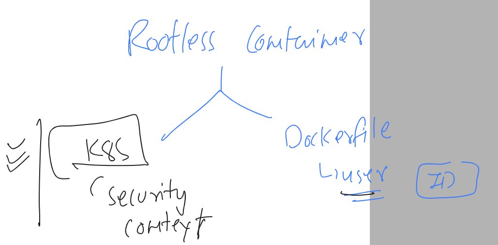

## Revision 


### Target for today 


### Note : even we don't have permmission of kubeconfig file but by using token of default svc account we can send some request from inside pod

```
root@ashupod1:/var/run/secrets/kubernetes.io/serviceaccount# curl https://10.96.0.1 -k 
{
  "kind": "Status",
  "apiVersion": "v1",
  "metadata": {},
  "status": "Failure",
  "message": "forbidden: User \"system:anonymous\" cannot get path \"/\"",
  "reason": "Forbidden",
  "details": {},
  "code": 403
}root@ashupod1:/var/run/secrets/kubernetes.io/serviceaccount# ls
ca.crt	namespace  token
root@ashupod1:/var/run/secrets/kubernetes.io/serviceaccount# curl https://10.96.0.1 -k -H "Authorization: Bearer $(cat token)"
{
  "kind": "Status",
  "apiVersion": "v1",
  "metadata": {},
  "status": "Failure",
  "message": "forbidden: User \"system:serviceaccount:testing:default\" cannot get path \"/\"",
  "reason": "Forbidden",
  "details": {},
  "code": 403
}root@ashupod1:/var/run/secrets/kubernetes.io/serviceaccount# 


```

### pod yaml as per best security practise 

```
apiVersion: v1
kind: Pod
metadata:
  creationTimestamp: null
  labels:
    run: ashupod1
  name: ashupod1
spec:
  serviceAccount: access
  automountServiceAccountToken: false
  containers:
  - image: nginx
    name: ashupod1
    ports:
    - containerPort: 80
    resources: {}
  dnsPolicy: ClusterFirst
  restartPolicy: Always
status: {}

```

### Application Security in Pod container model 


### making pod container as rootless 



### security context in k8s Pod 


### running pod container with root access

```
root@ip-172-31-22-49:~/yamls# cat  new.yaml 
apiVersion: v1
kind: Pod
metadata:
  creationTimestamp: null
  labels:
    run: test
  name: test
spec:
  containers:
  - command:
    - sleep
    - "1000"
    image: busybox
    name: test
    resources: {}
  dnsPolicy: ClusterFirst
  restartPolicy: Always
status: {}
```
### checking

```
root@ip-172-31-22-49:~/yamls# kubectl get po 
NAME   READY   STATUS    RESTARTS   AGE
test   1/1     Running   0          6m9s
root@ip-172-31-22-49:~/yamls# kubectl exec -it test  -- sh 
/ # 
/ # id
uid=0(root) gid=0(root) groups=0(root),10(wheel)
/ # pwd
/
/ # mkdir hello
/ # ls
bin    dev    etc    hello  home   lib    lib64  proc   root   sys    tmp    tt     usr    var
/ # exit

```

### POd with security context yaml 

```
root@ip-172-31-22-49:~/yamls# cat new.yaml 
apiVersion: v1
kind: Pod
metadata:
  creationTimestamp: null
  labels:
    run: test
  name: test
spec:
  securityContext:
    runAsUser: 1000
    runAsGroup: 3000
  containers:

```

### redeploy this and check it 

```
root@ip-172-31-22-49:~/yamls# kubectl get  po 
NAME   READY   STATUS    RESTARTS   AGE
test   1/1     Running   0          44s
root@ip-172-31-22-49:~/yamls# 
root@ip-172-31-22-49:~/yamls# kubectl exec -it test -- sh 
~ $ 
~ $ 
~ $ id
uid=1000 gid=3000 groups=3000
~ $ cd /
~ $ pwd
/
~ $ mkdir heyyy
mkdir: can't create directory 'heyyy': Permission denied
~ $ exit
command terminated with exit code 1
root@ip-172-31-22-49:~/yamls# 
```

