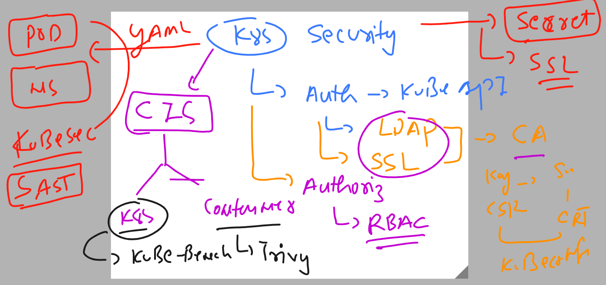
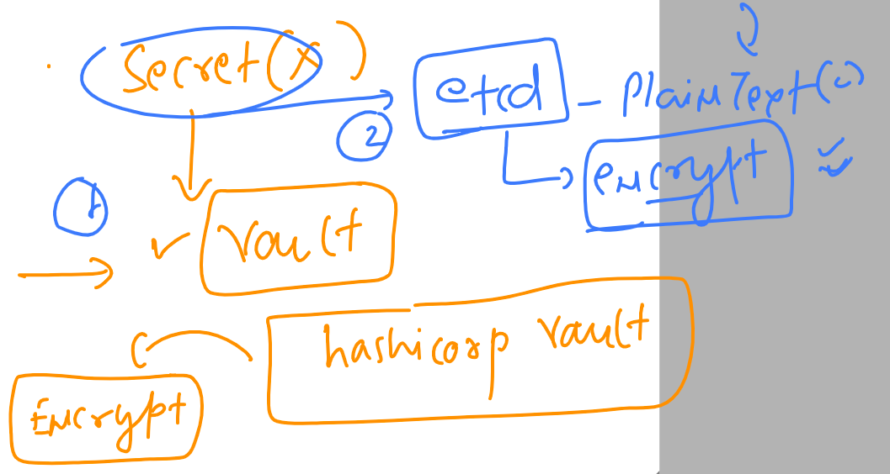
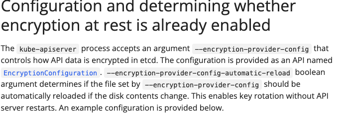
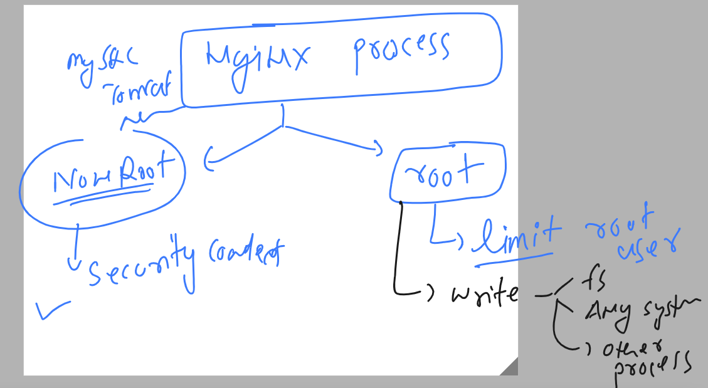
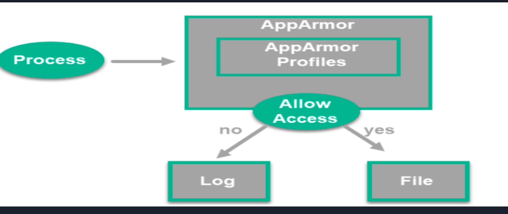

## Revision 



### Using secret in k8s is not a good security practise 

```
root@ip-172-31-22-49:~/yamls# kubectl  create  ns  day5 
namespace/day5 created
root@ip-172-31-22-49:~/yamls# kubectl config set-context --current --namespace day5
Context "kubernetes-admin@kubernetes" modified.
root@ip-172-31-22-49:~/yamls# kubectl create secret
Create a secret using specified subcommand.

Available Commands:
  docker-registry   Create a secret for use with a Docker registry
  generic           Create a secret from a local file, directory, or literal value
  tls               Create a TLS secret

Usage:
  kubectl create secret [flags] [options]

Use "kubectl <command> --help" for more information about a given command.
Use "kubectl options" for a list of global command-line options (applies to all commands).
root@ip-172-31-22-49:~/yamls# 


root@ip-172-31-22-49:~/yamls# 
root@ip-172-31-22-49:~/yamls# 
root@ip-172-31-22-49:~/yamls# 
root@ip-172-31-22-49:~/yamls# 
root@ip-172-31-22-49:~/yamls# kubectl get  secret
No resources found in day5 namespace.
root@ip-172-31-22-49:~/yamls# 
root@ip-172-31-22-49:~/yamls# kubectl create secret generic  my-sec  --from-literal  Pass="K8s@098$" 
secret/my-sec created
root@ip-172-31-22-49:~/yamls# kubectl  get secret
NAME     TYPE     DATA   AGE
my-sec   Opaque   1      5s
root@ip-172-31-22-49:~/yamls# kubectl describe secret my-sec 
Name:         my-sec
Namespace:    day5
Labels:       <none>
Annotations:  <none>

Type:  Opaque

Data
====
Pass:  8 bytes
root@ip-172-31-22-49:~/yamls# kubectl get  secrets my-sec -o yaml 
apiVersion: v1
data:
  Pass: SzhzQDA5OCQ=
kind: Secret

```

### lets query etcd like a database 

```
root@ip-172-31-22-49:~/yamls# ETCDCTL_API=3  etcdctl --cert  /etc/kubernetes/pki/apiserver-etcd-client.crt  --key  /etc/kubernetes/pki/apiserver-etcd-client.key  --cacert /etc/kubernetes/pki/etcd/ca.crt  get    /registry/secrets/day5/my-sec
/registry/secrets/day5/my-sec
k8s


v1Secret?
?
my-secday5"*$1dfefdf1-8592-416c-a063-64a7ea6712bd2??ݡ?a
kubectl-createUpdatev??ݡFieldsV1:-
+{"f:data":{".":{},"f:Pass":{}},"f:type":{}}B
PasK8s@098$Opaque"
root@ip-172-31-22-49:~/yamls# 
```
### secret replacement or options 



### Using Encryptionconfig to encrypt etcd data with respect to api resources 

### checking flag in kube-apiserver.yaml 



### to implement resource encryption at REST 

```
root@ip-172-31-22-49:~/yamls# cat encrypt.yaml 
apiVersion: apiserver.config.k8s.io/v1
kind: EncryptionConfiguration
resources:
  - resources:
      - secrets
    providers:
      - aescbc:
          keys:
            - name: key1
              secret: SGVsbG9QYXNzQDEyMw== 
      - identity: {}

```

#### How to generate base64 password 

```
root@ip-172-31-22-49:~/yamls#  echo -n "HelloPass@123"  | base64 
SGVsbG9QYXNzQDEyMw==
```

## Security context with nonroot user is not easy to implement 

```
root@ip-172-31-22-49:~/yamls# cat ng.yaml 
apiVersion: v1
kind: Pod
metadata:
  creationTimestamp: null
  labels:
    run: hello
  name: hello
spec:
  securityContext: # pod level
   runAsUser: 10001
   runAsGroup: 30001
  containers:
  - image: nginx
    name: hello
    ports:
    - containerPort: 80
    resources: {}
  dnsPolicy: ClusterFirst
  restartPolicy: Always
status: {}

```

### if apply it 

```
root@ip-172-31-22-49:~/yamls# kubectl apply -f ng.yaml 
pod/hello created
root@ip-172-31-22-49:~/yamls# kubectl get po 
NAME    READY   STATUS             RESTARTS     AGE
hello   0/1     CrashLoopBackOff   1 (3s ago)   5s
root@ip-172-31-22-49:~/yamls# kubectl get po 
NAME    READY   STATUS   RESTARTS      AGE
hello   0/1     Error    2 (26s ago)   28s
root@ip-172-31-22-49:~/yamls# kubectl get po 

```

### Understanding problem 



### Understanding ns , cgroup and syscalls


### Seccomp vs apparmor 


### apparmor profiles 



## apparmor demo

### apparmor status 

```
root@ip-172-31-21-222:~# systemctl status apparmor.service 
● apparmor.service - Load AppArmor profiles
     Loaded: loaded (/lib/systemd/system/apparmor.service; enabled; vendor preset: enabled)
     Active: active (exited) since Thu 2023-04-13 04:18:53 UTC; 5min ago
       Docs: man:apparmor(7)
             https://gitlab.com/apparmor/apparmor/wikis/home/
   Main PID: 337 (code=exited, status=0/SUCCESS)

```

### configuration files 

```
root@ip-172-31-21-222:~# cd  /etc/apparmor
apparmor/   apparmor.d/ 
root@ip-172-31-21-222:~# cd  /etc/apparmor
root@ip-172-31-21-222:/etc/apparmor# ls
init  parser.conf

```

### location where apparmor is storing profiles 

```
root@ip-172-31-21-222:/etc/apparmor.d# cd /etc/apparmor.d/
root@ip-172-31-21-222:/etc/apparmor.d# ls
abstractions  force-complain  lsb_release      sbin.dhclient  usr.bin.man                      usr.sbin.rsyslogd
disable       local           nvidia_modprobe  tunables       usr.lib.snapd.snap-confine.real  usr.sbin.tcpdump
root@ip-172-31-21-222:/etc/apparmor.d# 


```


