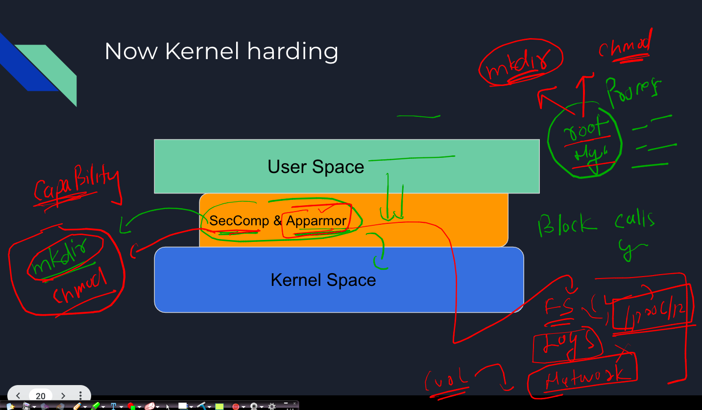

## Revision 


### Using secret in k8s is not a good security practise 

```
root@ip-172-31-22-49:~/yamls# kubectl  create  ns  day5 
namespace/day5 created
root@ip-172-31-22-49:~/yamls# kubectl config set-context --current --namespace day5
Context "kubernetes-admin@kubernetes" modified.
root@ip-172-31-22-49:~/yamls# kubectl create secret
Create a secret using specified subcommand.

Available Commands:
  docker-registry   Create a secret for use with a Docker registry
  generic           Create a secret from a local file, directory, or literal value
  tls               Create a TLS secret

Usage:
  kubectl create secret [flags] [options]

Use "kubectl <command> --help" for more information about a given command.
Use "kubectl options" for a list of global command-line options (applies to all commands).
root@ip-172-31-22-49:~/yamls# 


root@ip-172-31-22-49:~/yamls# 
root@ip-172-31-22-49:~/yamls# 
root@ip-172-31-22-49:~/yamls# 
root@ip-172-31-22-49:~/yamls# 
root@ip-172-31-22-49:~/yamls# kubectl get  secret
No resources found in day5 namespace.
root@ip-172-31-22-49:~/yamls# 
root@ip-172-31-22-49:~/yamls# kubectl create secret generic  my-sec  --from-literal  Pass="K8s@098$" 
secret/my-sec created
root@ip-172-31-22-49:~/yamls# kubectl  get secret
NAME     TYPE     DATA   AGE
my-sec   Opaque   1      5s
root@ip-172-31-22-49:~/yamls# kubectl describe secret my-sec 
Name:         my-sec
Namespace:    day5
Labels:       <none>
Annotations:  <none>

Type:  Opaque

Data
====
Pass:  8 bytes
root@ip-172-31-22-49:~/yamls# kubectl get  secrets my-sec -o yaml 
apiVersion: v1
data:
  Pass: SzhzQDA5OCQ=
kind: Secret

```

### lets query etcd like a database 

```
root@ip-172-31-22-49:~/yamls# ETCDCTL_API=3  etcdctl --cert  /etc/kubernetes/pki/apiserver-etcd-client.crt  --key  /etc/kubernetes/pki/apiserver-etcd-client.key  --cacert /etc/kubernetes/pki/etcd/ca.crt  get    /registry/secrets/day5/my-sec
/registry/secrets/day5/my-sec
k8s


v1Secret?
?
my-secday5"*$1dfefdf1-8592-416c-a063-64a7ea6712bd2??ݡ?a
kubectl-createUpdatev??ݡFieldsV1:-
+{"f:data":{".":{},"f:Pass":{}},"f:type":{}}B
PasK8s@098$Opaque"
root@ip-172-31-22-49:~/yamls# 
```
### secret replacement or options 


### Using Encryptionconfig to encrypt etcd data with respect to api resources 

### checking flag in kube-apiserver.yaml 


### to implement resource encryption at REST 

```
root@ip-172-31-22-49:~/yamls# cat encrypt.yaml 
apiVersion: apiserver.config.k8s.io/v1
kind: EncryptionConfiguration
resources:
  - resources:
      - secrets
    providers:
      - aescbc:
          keys:
            - name: key1
              secret: SGVsbG9QYXNzQDEyMw== 
      - identity: {}

```

#### How to generate base64 password 

```
root@ip-172-31-22-49:~/yamls#  echo -n "HelloPass@123"  | base64 
SGVsbG9QYXNzQDEyMw==
```

## Security context with nonroot user is not easy to implement 

```
root@ip-172-31-22-49:~/yamls# cat ng.yaml 
apiVersion: v1
kind: Pod
metadata:
  creationTimestamp: null
  labels:
    run: hello
  name: hello
spec:
  securityContext: # pod level
   runAsUser: 10001
   runAsGroup: 30001
  containers:
  - image: nginx
    name: hello
    ports:
    - containerPort: 80
    resources: {}
  dnsPolicy: ClusterFirst
  restartPolicy: Always
status: {}

```

### if apply it 

```
root@ip-172-31-22-49:~/yamls# kubectl apply -f ng.yaml 
pod/hello created
root@ip-172-31-22-49:~/yamls# kubectl get po 
NAME    READY   STATUS             RESTARTS     AGE
hello   0/1     CrashLoopBackOff   1 (3s ago)   5s
root@ip-172-31-22-49:~/yamls# kubectl get po 
NAME    READY   STATUS   RESTARTS      AGE
hello   0/1     Error    2 (26s ago)   28s
root@ip-172-31-22-49:~/yamls# kubectl get po 

```

### Understanding problem 


### Understanding ns , cgroup and syscalls


### Seccomp vs apparmor 



### apparmor profiles 


## apparmor demo

### apparmor status 

```
root@ip-172-31-21-222:~# systemctl status apparmor.service 
● apparmor.service - Load AppArmor profiles
     Loaded: loaded (/lib/systemd/system/apparmor.service; enabled; vendor preset: enabled)
     Active: active (exited) since Thu 2023-04-13 04:18:53 UTC; 5min ago
       Docs: man:apparmor(7)
             https://gitlab.com/apparmor/apparmor/wikis/home/
   Main PID: 337 (code=exited, status=0/SUCCESS)

```

### configuration files 

```
root@ip-172-31-21-222:~# cd  /etc/apparmor
apparmor/   apparmor.d/ 
root@ip-172-31-21-222:~# cd  /etc/apparmor
root@ip-172-31-21-222:/etc/apparmor# ls
init  parser.conf

```

### location where apparmor is storing profiles 

```
root@ip-172-31-21-222:/etc/apparmor.d# cd /etc/apparmor.d/
root@ip-172-31-21-222:/etc/apparmor.d# ls
abstractions  force-complain  lsb_release      sbin.dhclient  usr.bin.man                      usr.sbin.rsyslogd
disable       local           nvidia_modprobe  tunables       usr.lib.snapd.snap-confine.real  usr.sbin.tcpdump
root@ip-172-31-21-222:/etc/apparmor.d# 


```


### profile modes


### list profiles 

```
root@ip-172-31-21-222:~# aa-status 
apparmor module is loaded.
40 profiles are loaded.
38 profiles are in enforce mode.
   /snap/snapd/18596/usr/lib/snapd/snap-confine
   /snap/snapd/18596/usr/lib/snapd/snap-confine//mount-namespace-capture-helper
   /usr/bin/man
   /usr/lib/NetworkManager/nm-dhcp-cl
```

### testing apparmor with curl command 

```
root@ip-172-31-21-222:~# curl  ifconfig.me  -v
*   Trying 34.160.111.145:80...
* TCP_NODELAY set
* Connected to ifconfig.me (34.160.111.145) port 80 (#0)
> GET / HTTP/1.1
> Host: ifconfig.me
> User-Agent: curl/7.68.0
> Accept: */*
> 

```

### creating profile for curl command 

```
root@ip-172-31-21-222:~# apt install apparmor-utils ---> will be giving aa-genprof 


```

### do ti 

```
root@ip-172-31-21-222:~# aa-genprof  /usr/bin/curl  
Writing updated profile for /usr/bin/curl.
Setting /usr/bin/curl to complain mode.

Before you begin, you may wish to check if a
profile already exists for the application you
wish to confine. See the following wiki page for
more information:
https://gitlab.com/apparmor/apparmor/wikis/Profiles

Profiling: /usr/bin/curl

Please start the application to be profiled in
another window and exercise its functionality now.

Once completed, select the "Scan" option below in 
order to scan the system logs for AppArmor events. 

For each AppArmor event, you will be given the 
opportunity to choose whether the access should be 
allowed or denied.

[(S)can system log for AppArmor events] / (F)inish
Setting /usr/bin/curl to enforce mode.

Reloaded AppArmor profiles in enforce mode.

Please consider contributing your new profile!
See the following wiki page for more information:
https://gitlab.com/apparmor/apparmor/wikis/Profiles

Finished generating profile for /usr/bin/curl.

```

### checking it 

```
root@ip-172-31-21-222:~# aa-status    | grep -i curl 
   /usr/bin/curl
root@ip-172-31-21-222:~# 


```

### doing with curl 

### check curl 

```
root@ip-172-31-21-222:~# curl ifconfig.me -v
* Could not resolve host: ifconfig.me
* Closing connection 0
curl: (6) Could not resolve host: ifconfig.me
root@ip-172-31-21-222:~# 


```

### change profile mode to complain 

```
root@ip-172-31-21-222:~# aa-complain /usr/bin/curl 
Setting /usr/bin/curl to complain mode.
root@ip-172-31-21-222:~# 
root@ip-172-31-21-222:~# 

```

### testing it again 

```
root@ip-172-31-21-222:~# curl ifconfig.me -v
*   Trying 34.160.111.145:80...
* TCP_NODELAY set
* Connected to ifconfig.me (34.160.111.145) port 80 (#0)
> GET / HTTP/1.1
> Host: ifconfig.me
> User-Agent: curl/7.68.0
> Accept: */*
> 
* Mark bundle as not supporting mul
```

### creating new docker profile for nginx container 

```
vim /etc/apparmor.d/ashu-nginx-docker 
----
#include <tunables/global>


profile docker-nginx flags=(attach_disconnected,mediate_deleted) {
  #include <abstractions/base>

  network inet tcp,
  network inet udp,
  network inet icmp,

  deny network raw,

  deny network packet,

  file,
  umount,

  deny /bin/** wl,
  deny /boot/** wl,
  deny /dev/** wl,
  deny /etc/** wl,
  deny /home/** wl,
  deny /lib/** wl,
  deny /lib64/** wl,
  deny /media/** wl,
  deny /mnt/** wl,
  deny /opt/** wl,
  deny /proc/** wl,
  deny /root/** wl,
  deny /sbin/** wl,
  deny /srv/** wl,
  deny /tmp/** wl,
  deny /sys/** wl,
  deny /usr/** wl,

  audit /** w,

  /var/run/nginx.pid w,

  /usr/sbin/nginx ix,

  deny /bin/dash mrwklx,
  deny /bin/sh mrwklx,
  deny /usr/bin/top mrwklx,


  capability chown,
  capability dac_override,
  capability setuid,
  capability setgid,
  capability net_bind_service,

  deny @{PROC}/* w,   # deny write for all files directly in /proc (not in a subdir)
  # deny write to files not in /proc/<number>/** or /proc/sys/**
  deny @{PROC}/{[^1-9],[^1-9][^0-9],[^1-9s][^0-9y][^0-9s],[^1-9][^0-9][^0-9][^0-9]*}/** w,
  deny @{PROC}/sys/[^k]** w,  # deny /proc/sys except /proc/sys/k* (effectively /proc/sys/kernel)
  deny @{PROC}/sys/kernel/{?,??,[^s][^h][^m]**} w,  # deny everything except shm* in /proc/sys/kernel/
  deny @{PROC}/sysrq-trigger rwklx,
  deny @{PROC}/mem rwklx,
  deny @{PROC}/kmem rwklx,
  deny @{PROC}/kcore rwklx,

  deny mount,

  deny /sys/[^f]*/** wklx,
  deny /sys/f[^s]*/** wklx,
  deny /sys/fs/[^c]*/** wklx,
  deny /sys/fs/c[^g]*/** wklx,
  deny /sys/fs/cg[^r]*/** wklx,
  deny /sys/firmware/** rwklx,
  deny /sys/kernel/security/** rwklx,
}

```

### lets load profile 

```
apparmor_parser  -r -W  /etc/apparmor.d/ashu-nginx-docker 
```

### checking 

```
root@ip-172-31-21-222:/etc/apparmor.d# aa-status  | grep -i docker 
   docker-default
   docker-nginx

```

### doing in docker 

```
docker run -itd --name c3   --security-opt "apparmor=docker-nginx"     nginx 
```


