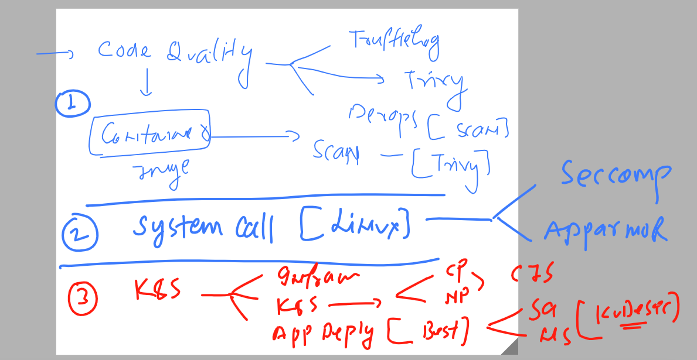

## K8s security final 

### K8s best practise for deployment of app 



### checking system call for any application 

```
test@ip-172-31-21-222:~$ strace -c   touch  /tmp/ashu.txt   
% time     seconds  usecs/call     calls    errors syscall
------ ----------- ----------- --------- --------- ----------------
 30.43    0.000143           7        19           openat
 24.68    0.000116           5        22           close
 20.43    0.000096           4        22           mmap
 17.87    0.000084           4        18           fstat
  4.89    0.000023          23         1           utimensat
  1.70    0.000008           8         1           dup2
  0.00    0.000000           0         3           read
  0.00    0.000000           0         3           mprotect
  0.00    0.000000           0         1           munmap
  0.00    0.000000           0         3           brk
  0.00    0.000000           0         6           pread64
  0.00    0.000000           0         1         1 access
  0.00    0.000000           0         1           execve
  0.00    0.000000           0         2         1 arch_prctl
------ ----------- ----------- --------- --------- ----------------
100.00    0.000470                   103         2 total
```


### understanding seccom vs apparmor 


### checking seccomp  status 

```
root@ip-172-31-21-222:/boot# grep -i seccomp /boot/config-$(uname -r)
CONFIG_HAVE_ARCH_SECCOMP=y
CONFIG_HAVE_ARCH_SECCOMP_FILTER=y
CONFIG_SECCOMP=y
CONFIG_SECCOMP_FILTER=y
# CONFIG_SECCOMP_CACHE_DEBUG is not set

```

### Seccomp activation modes 


### How to check seccomp status of container process {main / parent process}

```
test@ip-172-31-21-222:~$ docker run -it --rm   alpine  sh 
/ # whoami
root
/ # ps -e
PID   USER     TIME  COMMAND
    1 root      0:00 sh
    8 root      0:00 ps -e
/ # grep -i seccomp /proc/1/status 
Seccomp:	2
Seccomp_filters:	1
/ # 

```

### default blocked system call id time adjust 

```
test@ip-172-31-21-222:~$ docker run -ti --rm docker/whalesay  sh 
# grep -i seccomp /proc/1/status
Seccomp:	2
Seccomp_filters:	1
# date -s "13 April 2022 18:19:09"                    
date: cannot set date: Operation not permitted
Wed Apr 13 18:19:09 UTC 2022
# date
Fri Apr 14 03:36:42 UTC 2023
# whoami
root
# id
uid=0(root) gid=0(root) groups=0(root)
# 

```

### using custom profile for seccomp 

```
test@ip-172-31-21-222:~$ docker run -it --rm  --security-opt seccomp=/home/test/ashu/custom.json  alpine  sh 
/ # 
/ # id
uid=0(root) gid=0(root) groups=0(root),1(bin),2(daemon),3(sys),4(adm),6(disk),10(wheel),11(floppy),20(dialout),26(tape),27(video)
/ # mkdir  /okk
mkdir: can't create directory '/okk': Operation not permitted
/ # mkdir  /var/fine
mkdir: can't create directory '/var/fine': Operation not permitted
/ # exit

```


